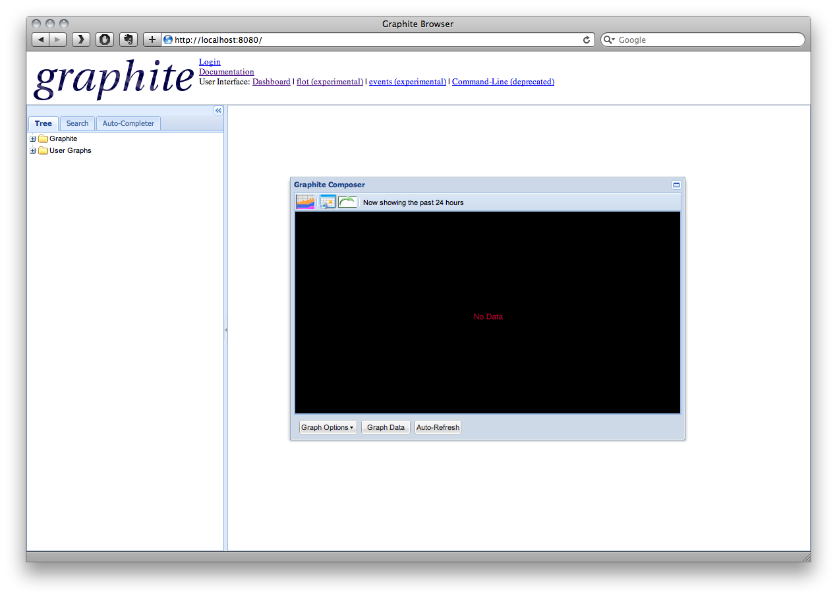

!SLIDE
# "making sense" #
!SLIDE center
# Meet the composer #

!SLIDE
[ demo: compose-a-graph ]

.notes Apply a function, nonNegativeDerivative, talk about composability, how different data can be combined easily
