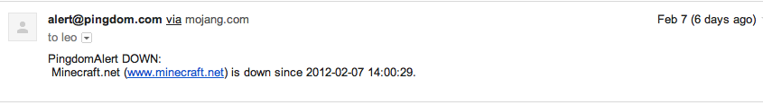

!SLIDE subsection
# What's the state of your application?

.notes I'd like to start by asking you to think about what you know
about the state of your application. What's happening? What are your
users doing? How do you get information about it?

!SLIDE center

.notes you might get it from a user, sadly not that uncommon

!SLIDE
or your
# boss complaining

.notes you might even have your pointy haired boss come over to bash
his hand into your desk and start shouting about a problem

!SLIDE
# Hopefully an alarm

.notes or in most cases, you get an alarm from your monitoring system
telling you that your site is down.

!SLIDE
# Is that enough?

.notes now, my question to you is: is that really enough? Isn't that a
bit late to know what's happening in the application?

!SLIDE

.notes default operations with green and red buttons for when things
are working and not. cpu, memory, 200 codes from web apps

!SLIDE

.notes graphs over realtime data of application centric information
such as logins, transactions messages added to a queue
