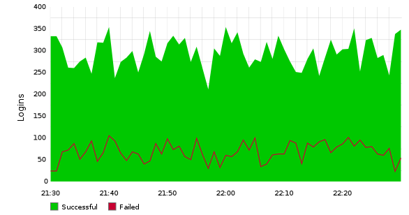

!SLIDE subsection
# The difference

.notes diff kinds, alarms vs application centric data and graphs -> meaning

!SLIDE center
# Application metrics

.notes things like: logins/minute or payment transactions. Tells you
about your application.

!SLIDE center
# Getting to know your app

.notes brain pattern matching, see trends, learn about the application
and how it behaves. Looking at the data every morning, what my users
are doing.

!SLIDE center
# The watercooler effect

.notes app metrics -> other people are curious. pretty -> even more
people are curious. even biz that asks what something app centric means

!SLIDE
# A common language

.notes the graphs acts as a facility to create a common ground. As
people from different parts of the organization looks at it. example:
perf issue, apparent by graph. Esp since he already knows it.

!SLIDE
but
# I'm a developer

.notes you should know your application. To know it -> put through its
motions and see what happens.

!SLIDE bullets
# Start early
* finding your vital metrics takes time

.notes going live is to late, won't watch appcentric data and won't
know how the app works. Ops keep stuff running and probably won't
learn it, at least not very quickly. You need to add metrics early to
learn the app and to learn what metrics are vital to YOUR application.

!SLIDE bullets
# Requirements in development
* do load testing
* (preferrably) involvement in production

.notes if you have users, you should see what happens when the app is
run by those users. If you have more than 10 users, you should watch
vital app metrics, your understanding of the app probably won't be
enough.
